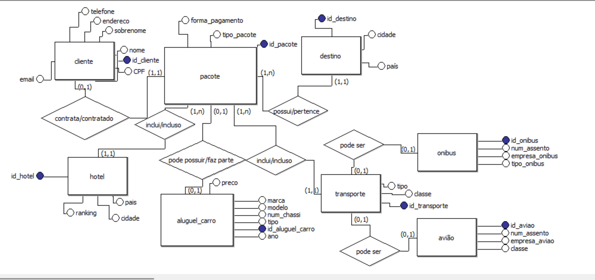

# Agência de Viagem

Bem-vindo ao repositório da Agência de Viagem! Este projeto tem como objetivo fornecer uma plataforma para gerenciar reservas de viagens, incluindo voos, hotéis e pacotes turísticos.

## Sobre o Projeto

Projeto feito no curso Recode Pro Ai, esta é a Primeira entrega.

## Tecnologias Utilizadas

- **Frontend**: HTML, CSS, JavaScript

## Modelagem de Dados

A modelagem conceitual e lógica foi feita utilizando o BR Modelo. A modelagem física foi realizada usando o MySQL.

## Modelagem Conceitual

## Funcionamento do Projeto

Cada cliente que deseja realizar uma viagem precisa contratar um pacote. Existem três opções de pacotes disponíveis: Básico, Plus e Premium. Cada pacote inclui um destino escolhido pelo cliente, um hotel associado e uma passagem (de avião ou carro). O aluguel de carro está incluído apenas no pacote Premium, mas pode ser contratado separadamente nos pacotes Básico e Plus.

## Contribuição

Contribuições são bem-vindas! Sinta-se à vontade para abrir issues e enviar pull requests.

## Licença

Este projeto está licenciado sob a licença MIT. 
